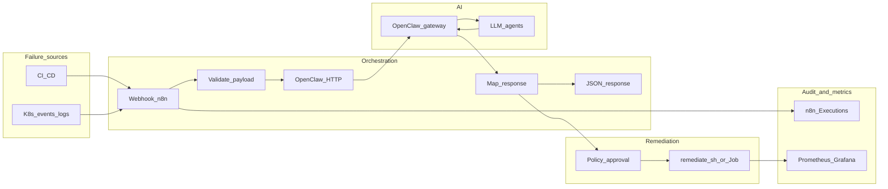

# HealMesh

**Self-healing enterprise automation mesh**

**HealMesh** wires together **n8n** (workflows), **OpenClaw** (AI gateway and agents), and **Kubernetes** so operational failures can be **detected**, **reasoned about**, and **remediated** with optional human approval. The same pattern can extend to **data pipelines** (schema drift, ETL config updates) as a future layer.

**Naming:** The product is **HealMesh**. This repository still uses **`prism`** in paths (Kubernetes namespace, Helm chart, sample workflow filename) so existing infra keeps working without a large rename.

---

## Table of contents

1. [Problem and goals](#problem-and-goals)  
2. [How it works](#how-it-works)  
3. [What is implemented today](#what-is-implemented-today)  
4. [Repository layout](#repository-layout)  
5. [Key files for reviewers](#key-files-for-reviewers)  
6. [How to run and demo](#how-to-run-and-demo)  
7. [Team roles](#team-roles)  
8. [License and notices](#license-and-notices)

---

## Problem and goals

**Problem:** CI/CD and cluster rollouts fail for many reasons (bad YAML, dependency conflicts, image tags, resource limits). Fixing them often means reading logs, guessing root cause, and applying manual patches under time pressure.

**Goals:**

- **Automate the glue** between failure signals, AI-assisted diagnosis, and safe actions.  
- **Keep humans in the loop** for risky changes (approve / reject).  
- **Leave an audit trail** (n8n Executions for MVP; optional Postgres later).  
- **Deploy on Kubernetes** with sensible RBAC and optional Prometheus / Grafana.

---

## How it works

### Plain-language flow

1. Something fails (pipeline, deployment, or a forwarded “incident” from another system).  
2. A client sends a **structured JSON incident** to an **n8n webhook** (see [`backend/CONTRACTS.md`](backend/CONTRACTS.md)).  
3. n8n **validates** required fields, then calls **OpenClaw** (HTTP) with that context so an **LLM-backed agent** can return **diagnosis** and a **machine-oriented remediation** (for example: patch deployment, restart, scale, or helm-style upgrade — aligned with [`infra/scripts/remediate.sh`](infra/scripts/remediate.sh)).  
4. **Policy** (middleware / rules) and/or the **dashboard** can require **approval** before any change hits the cluster.  
5. **Infra** executes the approved action with a **scoped service account** in namespace `prism`.  
6. **Observability:** workflow runs appear in n8n **Executions**; cluster metrics can go to **Prometheus / Grafana** if enabled.

### Diagram

### The three pillars

| Piece | Role |
|-------|------|
| **n8n** | Trigger on HTTP (and later schedules or other nodes), branch on outcome, retry, notify Slack/Discord, call HTTP APIs. |
| **OpenClaw** | Front door to **agentic AI**: turn logs and incident JSON into structured **diagnosis + remediation**; enforce auth via token. |
| **Kubernetes + Helm** | Run n8n, OpenClaw, Postgres, Redis, and optional monitoring; **RBAC** limits what automation can patch; **scripts** standardize `kubectl` / `helm` actions. |

---

## What is implemented today

| Area | Status |
|------|--------|
| **Infra** | Helm chart under [`infra/helm/prism/`](infra/helm/prism/), K8s namespace and secrets template, `init-cluster.sh`, `remediate.sh`, optional monitoring scripts. |
| **Backend** | Importable n8n workflow [`backend/workflows/prism-incident.json`](backend/workflows/prism-incident.json): webhook, validation, **disabled** OpenClaw HTTP placeholder, mapper with **stub** fallback, JSON response. |
| **Contracts** | [`backend/CONTRACTS.md`](backend/CONTRACTS.md) defines webhook payload, OpenClaw request/response shape (provisional path), approval webhook sketch, errors. |
| **Handoff** | [`backend/HANDOFF.md`](backend/HANDOFF.md) tells middleware and infra what to confirm next; includes curl / PowerShell smoke test. |
| **Optional DB** | [`backend/migrations/001_remediation_incidents.sql`](backend/migrations/001_remediation_incidents.sql) for a future **Phase 2** dashboard store (not required for MVP). |
| **Frontend / Middleware** | Folders reserved for UI and OpenClaw config; fill per team plan. |

**MVP audit trail:** use n8n **Executions** (no custom DB required).

**After middleware finishes:** enable the **OpenClaw** HTTP node in the workflow, set URL and auth from [`backend/CONTRACTS.md`](backend/CONTRACTS.md), adjust the mapper if the JSON shape differs.

---

## Repository layout

| Path | Owner focus |
|------|-------------|
| [`frontend/`](frontend/) | Dashboard, alerts, manual overrides. |
| [`backend/`](backend/) | Workflows, contracts, migrations, handoff docs. |
| [`middleware/`](middleware/) | OpenClaw/agent config, prompts, policy code. |
| [`infra/`](infra/) | Helm, K8s YAML, scripts, monitoring assets, [`infra/requirements.md`](infra/requirements.md). |

---

## Key files for reviewers

| File | Why it matters |
|------|----------------|
| [`backend/CONTRACTS.md`](backend/CONTRACTS.md) | Single source of truth for JSON between webhook, n8n, and OpenClaw. |
| [`backend/workflows/prism-incident.json`](backend/workflows/prism-incident.json) | Runnable automation graph (import into n8n). |
| [`backend/HANDOFF.md`](backend/HANDOFF.md) | Integration checklist for OpenClaw and remediation execution. |
| [`infra/scripts/remediate.sh`](infra/scripts/remediate.sh) | Contract for `PATCH`, `REDEPLOY`, `SCALE`, `HELM_UPGRADE`. |
| [`infra/helm/prism/`](infra/helm/prism/) | How core services are deployed in-cluster. |

---

## How to run and demo

### 1. Cluster (optional for full stack)

Follow [`infra/requirements.md`](infra/requirements.md), fill secrets locally (do not commit real keys), run [`infra/scripts/init-cluster.sh`](infra/scripts/init-cluster.sh) from the correct working directory as described in that script.

### 2. n8n workflow (minimal demo)

1. Install or access **n8n** (local Docker or cluster).  
2. **Import** [`backend/workflows/prism-incident.json`](backend/workflows/prism-incident.json).  
3. **Activate** the workflow.  
4. **POST** a JSON body that satisfies the required fields in [`backend/CONTRACTS.md`](backend/CONTRACTS.md) section 3 (see sample in [`backend/HANDOFF.md`](backend/HANDOFF.md)).  
5. Expect a **200** response with `ok`, `incident`, `openclaw`, and `_source: stub` while OpenClaw HTTP is disabled.  
6. Open **Executions** in n8n to show the run history.

### 3. Submission checklist

- [ ] README (this file) explains problem, flow, and layout.  
- [ ] Contracts document matches what the workflow expects.  
- [ ] Workflow JSON imports without errors (or note n8n version).  
- [ ] Infra README or `requirements.md` lists how to deploy.  
- [ ] Secrets are **not** committed (see [`.gitignore`](.gitignore)).  
- [ ] Demo script or `HANDOFF.md` smoke test passes.

---

## Team roles

| Role | Typical responsibilities |
|------|---------------------------|
| **Frontend** | Operational dashboard, alerts, approve/reject, log viewer. |
| **Backend** | n8n workflows, JSON contracts, optional API or DB, retries. |
| **Middleware** | OpenClaw routes, agent prompts, policy, final response schema. |
| **Infra** | Kubernetes, Helm, secrets, monitoring, safe execution of remediations. |

---

## License and notices

See [`LICENSE`](LICENSE).

**HealMesh** is the hackathon project name. **OpenClaw**, **n8n**, **Samsung PRISM**, **Kubernetes**, and other trademarks belong to their respective owners. This submission is for educational / hackathon use unless your team agrees otherwise.
